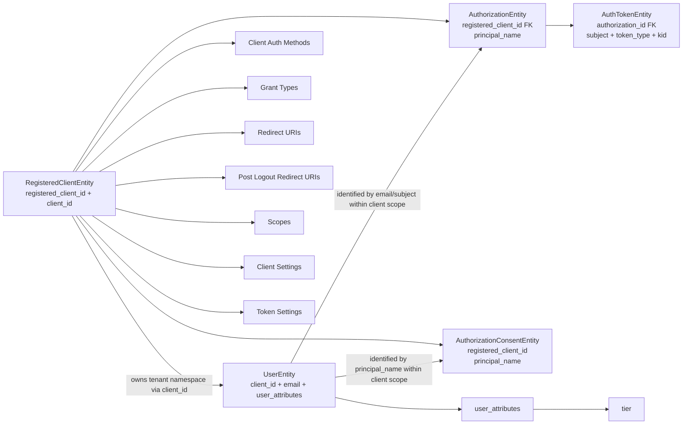

```mermaid
flowchart LR
    RC[RegisteredClientEntity\nregistered_client_id + client_id] -->|owns tenant namespace via client_id| U[UserEntity\nclient_id + email + user_attributes]

    RC --> AM[Client Auth Methods]
    RC --> GT[Grant Types]
    RC --> RU[Redirect URIs]
    RC --> PLRU[Post Logout Redirect URIs]
    RC --> SC[Scopes]
    RC --> CS[Client Settings]
    RC --> TS[Token Settings]

    RC --> AZ[AuthorizationEntity\nregistered_client_id FK\nprincipal_name]
    AZ --> TOK[AuthTokenEntity\nauthorization_id FK\nsubject + token_type + kid]

    RC --> CONSENT[AuthorizationConsentEntity\nregistered_client_id\nprincipal_name]

    U -->|identified by email/subject within client scope| AZ
    U -->|identified by principal_name within client scope| CONSENT
    U --> UA[user_attributes]
    UA --> T[tier]

```